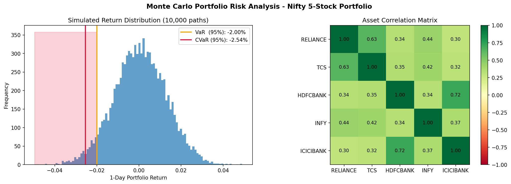

# Monte Carlo VaR & CVaR Portfolio Risk Engine

A quantitative finance tool built in Python that simulates 10,000 potential future market days to estimate the tail risk of an Indian equity portfolio using correlated Monte Carlo simulation.

Rather than relying purely on historical backtesting, the engine uses **Cholesky Decomposition** on the asset correlation matrix to generate realistic, correlated return paths — then derives institutional-grade risk metrics: **Value at Risk (VaR)** and **Conditional Value at Risk (CVaR / Expected Shortfall)**.

---

## Portfolio

5-stock NSE universe (Nifty large-caps), weighted by **live market capitalisation**:

| Stock | Ticker | Weight |
|-------|--------|--------|
| Reliance Industries | RELIANCE.NS | 34.70% |
| HDFC Bank | HDFCBANK.NS | 21.95% |
| TCS | TCS.NS | 16.83% |
| ICICI Bank | ICICIBANK.NS | 16.53% |
| Infosys | INFY.NS | 9.99% |

Weights are fetched dynamically at runtime via `yfinance` — not hardcoded — so they update as market caps change.

---

## Results

Historical data: **2020-01-01 to present** · Simulations: **10,000** · Confidence: **95%**

| Metric | MC Simulation | Historical Simulation |
|--------|:------------:|:--------------------:|
| VaR (95%, 1-day) | −2.04% | −1.69% |
| CVaR / Expected Shortfall (95%) | −2.60% | −2.94% |
| VaR on ₹10,00,000 portfolio | ₹20,440 | ₹16,929 |
| CVaR on ₹10,00,000 portfolio | ₹26,038 | ₹29,421 |

**MC vs Historical divergence:** The MC simulation produces a higher VaR (more conservative) but lower CVaR than historical simulation. This is expected — Monte Carlo assumes normally distributed shocks, which underweights the fat tails of real crash events (e.g., the COVID-19 drawdown in the training data), causing Historical CVaR to be more extreme.

> **VaR −2.04%:** On 95% of trading days, the portfolio will not lose more than 2.04% of its value.  
> **CVaR −2.60%:** In the worst 5% of scenarios, the average loss is 2.60% — the expected loss given a bad day.



---

## Methodology

### 1. Parameter Estimation
Extract daily drift (`μ`), volatility (`σ`), and the full Pearson correlation matrix from historical returns.

### 2. Cholesky Decomposition
Factorise the correlation matrix $\Sigma$ into a lower-triangular matrix $L$ such that $LL^T = \Sigma$. This allows independent random draws to be transformed into correlated ones.

### 3. Correlated Monte Carlo Simulation
Generate a 10,000 × 5 matrix of independent standard normal draws $Z$, then inject correlation:

$$Z_{\text{corr}} = Z \cdot L^T$$

Scale by historical volatility and shift by drift:

$$r_{\text{sim}} = \mu + \sigma \cdot Z_{\text{corr}}$$

### 4. Portfolio Aggregation
Combine simulated asset returns using market-cap weights $w$:

$$r_{\text{portfolio}} = r_{\text{sim}} \cdot w$$

### 5. Risk Metrics
- **VaR:** 5th percentile of the 10,000 simulated portfolio outcomes
- **CVaR:** Mean of all outcomes below the VaR threshold

### 6. Historical Benchmark
Repeat steps 4–5 on actual historical daily returns to compare MC estimates against observed data.

---

## Key Design Choices

- **Equal weights → Market-cap weights:** Model was first validated under a $1/N$ equal weighting baseline, then upgraded to dynamic market-cap weighting fetched live at runtime.
- **Cholesky over diagonal covariance:** A diagonal covariance matrix assumes zero correlation between assets — clearly wrong for Indian large-caps sharing macro exposure. Cholesky preserves the full correlation structure.
- **`np.random.seed(42)`:** Ensures reproducibility across runs.

---

## Running the Engine

Open `Code.ipynb` and run all cells top to bottom. Modify the `tickers` list under `# DATA` to use your own stock universe.

```bash
pip install numpy pandas yfinance matplotlib
```

---

## Tech Stack

Python · NumPy · Pandas · yfinance · Matplotlib
